# seqriseR

## Overview
Some extra themes and scales for [ggplot](http://ggplot2.org), and they are used on [Seqrise](https://seqrise.com/zh/index) platform.

#### Themes 
- ``theme_seqrise_classic``: a theme resembling the default base graphics in R. 
- ``theme_seqrise_grid``: a theme based on R default graphics, but with borders and grids on backgroud.

#### Scales

- ``scale_colour_seqrise``, ``scale_fill_seqrise``: classical discrete colour palettes.
- ``scale_colour_gradient_seqrise``,``scale_fill_gradient_seqrise``: sequential colour palettes.
- ``scale_colour_continuous_seqrise``, ``scale_fill_continuous_seqrise``: sequential colour palettes.
- ``scale_colour_gradient2_seqrise``,``scale_fill_gradient2_seqrise``: diverging colour gradient palettes.

## Install 

To install the development version from github, use the **devtools** package:

```r
library("devtools")
install_github(c("linruichai/seqriseR"))
```

## Contribute

Contributions are welcome! If you would like to add a theme, scales,etc., fork the repository, add your theme, and submit a pull request.

# Examples

```r
library('ggplot2')
library('seqriseR')
library('scales')
library('reshape2')

p <- ggplot(diamonds, aes(x = clarity, fill = cut)) + geom_bar()
```

## Classic theme

Theme resembling the base graphics in R, without top and right borders:

```r
p + theme_seqrise_classic()
```

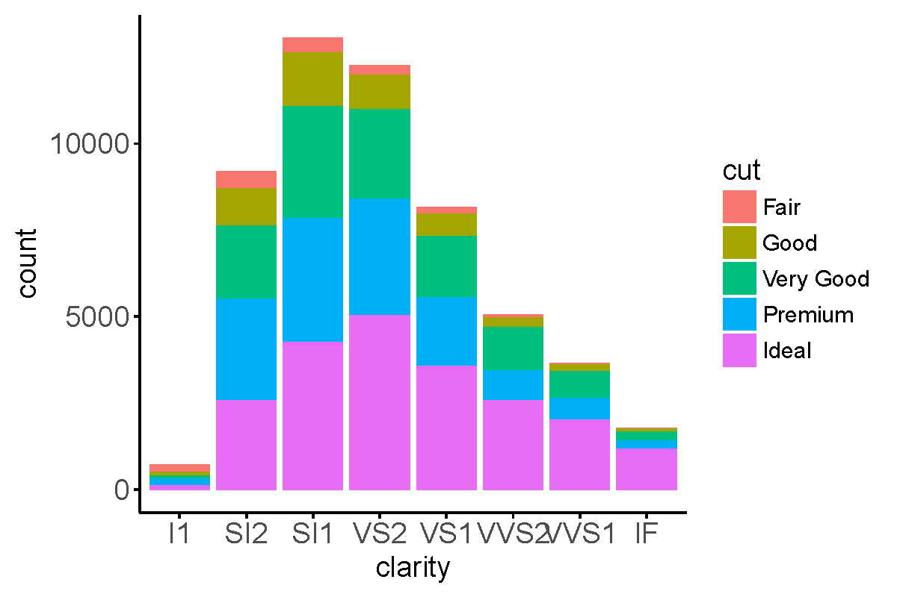

Change bar colors using `scale_fill_seqrise`:

```r
p + theme_seqrise_classic() + scale_fill_seqrise('seqrise9') 
```

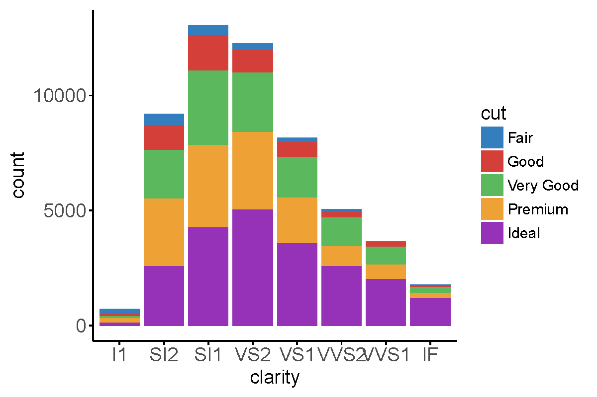

Adjust graphic elements after applying classic theme:

```r
p + theme_seqrise_classic(base_size = 14, base_family = 'Helvetica') +
  scale_fill_seqrise('seqrise9') +
  scale_y_continuous(expand=c(0,0)) +
  theme(legend.title = element_blank(),
    axis.text.x = element_text(angle = 45, hjust = 1))
```

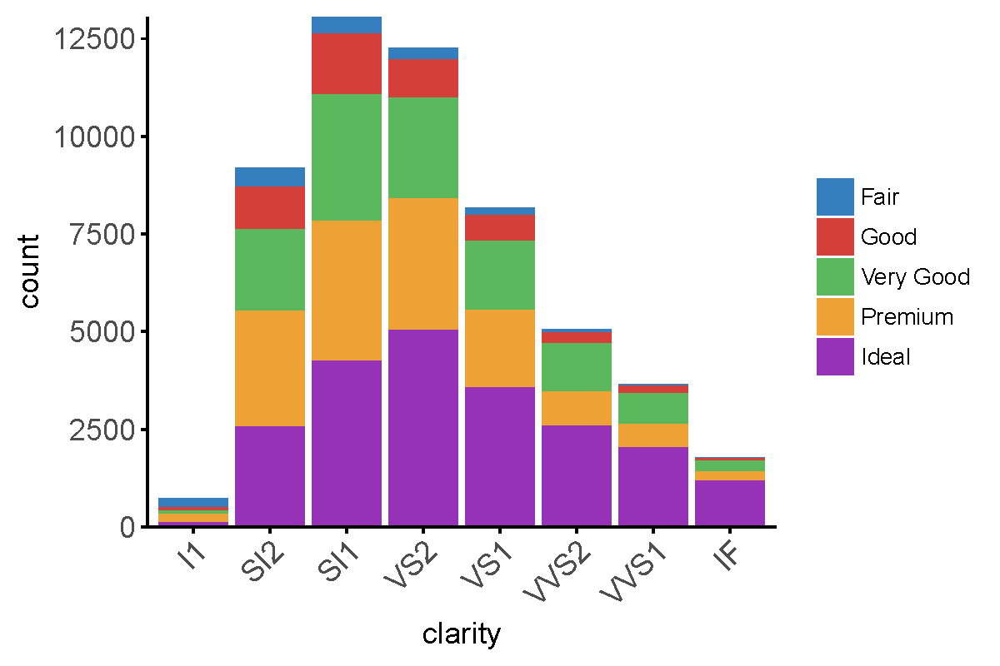

### Grid theme

A theme that approximates the style of classic theme, but with borders around and add gray grid on background:

```r
p + scale_fill_seqrise('seqrise9') + theme_seqrise_grid(base_size = 12) 
```

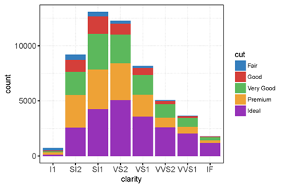

Both classic and grid themes accept ``base_size`` (default is 14) and ``base_family`` (default is 'Helvetica') as parameters.

### Scales

Some colour and fill scales used on [Seqrise](https://seqrise.com/zh/index) platform.

#### Discrete colors
```r
p1 <- ggplot(mtcars) +
  geom_point(aes(x = wt, y = mpg, colour=factor(gear))) +
  facet_wrap(~am) +
  theme_seqrise_grid()
p1 + scale_color_seqrise('seqrise9')
```

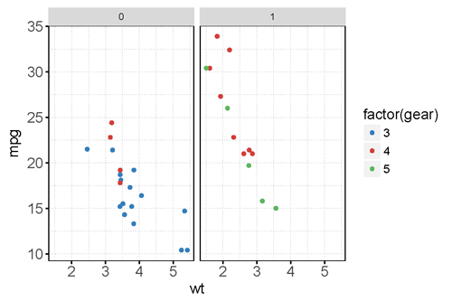

The following three color palletes can be accepted as parameters: ``'seqrise9'``, ``'seqrise9light'``, ``'seqrise18'``. The default is ``'seqrise9'``.

```r
show_col(seqrise_color_pal('seqrise9')(9))
```

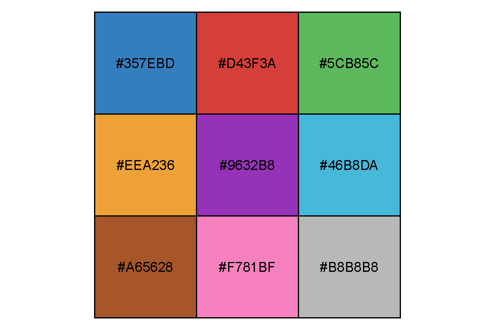

```r
show_col(seqrise_color_pal('seqrise9light')(9))
```

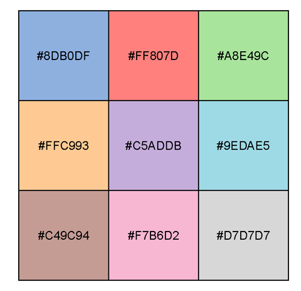

```r
show_col(seqrise_color_pal('seqrise18')(18))
```

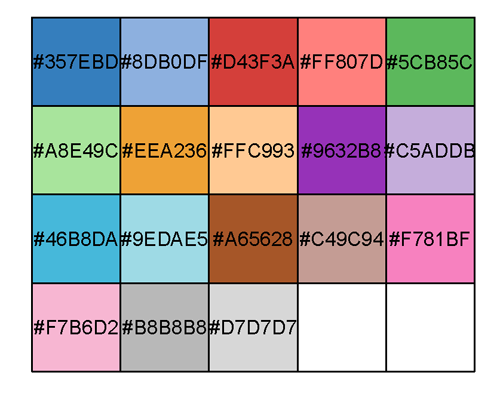

#### Sequential colors
```r
df <- data.frame(
  x = runif(100),
  y = runif(100),
  z1 = rnorm(100),
  z2 = abs(rnorm(100))
)

p2 <- ggplot(df, aes(x, y)) + geom_point(aes(colour = z2)) + theme_seqrise_classic()
p2 + scale_color_gradient_seqrise('Blue')
```

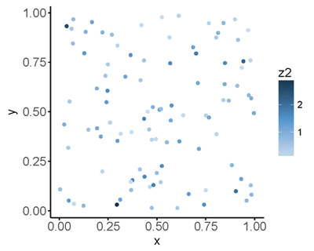


```r
mat = matrix(rnorm(96),8)
m = melt(mat)
p3 <- ggplot(m, aes(x = Var1, y = Var2, fill = value)) + 
  geom_tile(color="white", size=0.1) + 
  xlab('X-labels') + ylab('Y-labels') + 
  theme_seqrise_classic() + 
  theme(axis.line = element_blank(),
    axis.ticks = element_blank(),
    axis.text.x = element_blank(),
    axis.text.y = element_blank())
p3 + scale_fill_gradient_seqrise('Blue')
```

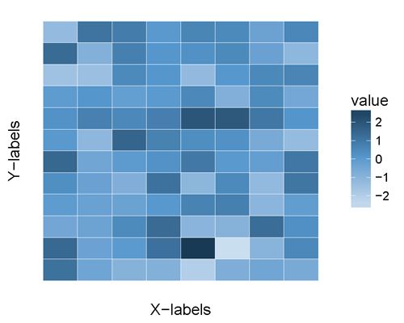

So far, only the parameter ``'Blue'`` is accepted for sequential color palette.

### Diverging gradient colors

```r
p2 + scale_color_gradient2_seqrise('Blue-White-Red')
```

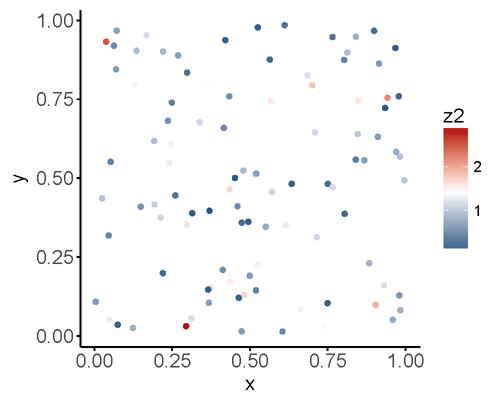

The following three color palletes can be accepted as parameters: ``'Blue-White-Red'``, ``'Green-Black-Red'``, ``'Yellow-Orange-Red'``, and the default is ``'Blue-White-Red'``.

```r
x <- seq(-1, 1, length = 100)
r <- sqrt(outer(x^2, x^2, '+'))
image(r, col = seqrise_div_gradient_pal('Blue-White-Red')(seq(0, 1, length = 12)))
```

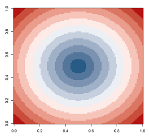

```r
image(r, col = seqrise_div_gradient_pal('Green-Black-Red')(seq(0, 1, length = 12)))
```

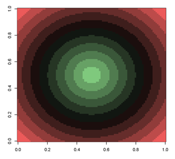

```r
image(r, col = seqrise_div_gradient_pal('Yellow-Orange-Red')(seq(0, 1, length = 12)))
```

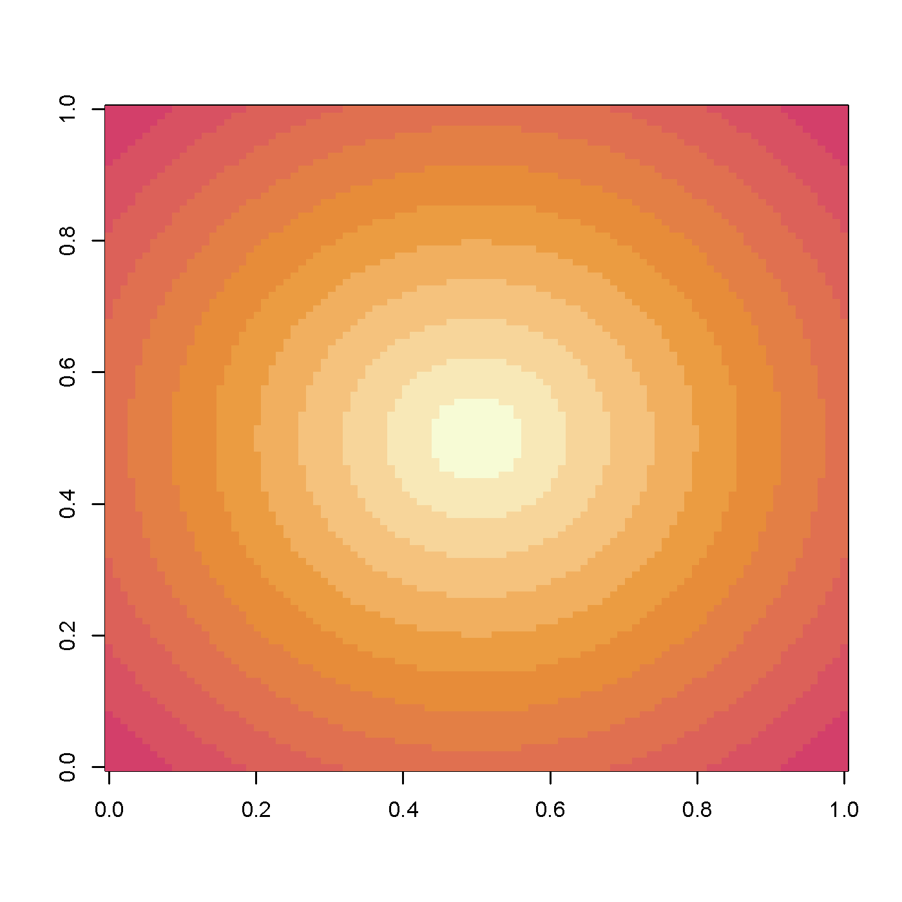
